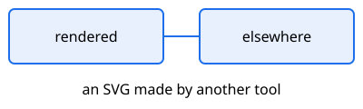
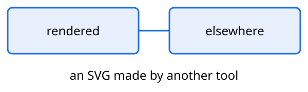

# What this is

Not an example — a fixture. Every section below is a defect someone hit in a
real document, and the build of this file is what proves it stays fixed. It has
to come out with no overfull line, no missing glyph and no warning at all, so
anything this file provokes is a regression.

`scripts/torture.sh` builds it and reads the log. Add a shape here whenever a
document finds a new one.

# Code blocks

A bare fence of 100 columns. It must be stepped down until it fits, and it must
not be wrapped: wrapping would move half of a row onto the next one and destroy
the alignment in silence.

```
Mesa -> Trainer -> Entrenamiento -> Modelo -> Inferencer -> Regla -> Alarma -> Mesa -> Informe -> Fin
Operaciones da de alta el plan; el trainer publica; la regla despliega; la mesa recibe la alarma.
```

A fence that declares a language, with a line longer than the measure. This one
is wrapped instead, and the continuation arrow says so.

```sh
mdbrand build informe.md --work ./out --brand amplia --output entregables/informe-revisado.pdf
```

A short one, which must stay at body size and prove the ladder only steps down
when it has to.

```go
func main() { fmt.Println("hola") }
```

# Inline code, in prose and in cells

A repository name in a sentence breaks where the identifier already has a
separator: `trainingplan-catalog-api`, `internal/rules/generator.go`,
`d2_scale`. LaTeX gives the mono family no hyphenation at all, so without the
rewrite in the preamble this paragraph overflows by the width of the whole
token.

The same inside a cell, which is narrower than the measure:

| Setting | Value |
|---|---|
| Source | `internal/fig/fig.go` |
| Flag | `--allow-missing-glyphs` |
| Key | `diagrams.min_text_pt` |

# Diagrams

A d2 fence using `vars`, with shapes three containers deep. mdbrand appends the
font-size globs to a copy of this source; the recursive form used to collide
with the `vars` block below and refuse to compile.

```d2 caption="Nested, with vars"
vars: {
  d2-config: {
    layout-engine: elk
  }
}
mesa: Mesa
og: OpenGate {
  trainer: Trainer
  runtime: Runtime {
    inferencer: Inferencer
  }
}
mesa -> og.trainer: listas
og.trainer -> og.runtime.inferencer: modelo
```

A side file that imports another one. The copy carrying the globs has to be
written beside it, because d2 resolves an import against the importing file's
own directory.


A Vega-Lite chart, to keep the other render route honest. Its data is a file
beside the document: the fenced source is copied into the work directory, and
vl2svg resolving the url from there drew an empty chart and exited 0.

```vegalite caption="Latency by percentile"
{
  "data": {"url": "data/latency.csv"},
  "mark": "bar",
  "encoding": {
    "x": {"field": "p", "type": "nominal", "title": "Percentile"},
    "y": {"field": "ms", "type": "quantitative", "title": "ms"}
  },
  "config": {"axis": {"labelFontSize": 14, "titleFontSize": 14}}
}
```

An SVG rendered by some other tool, linked as a plain picture. Left to pandoc
it became \includesvg — Inkscape, and a relative path looked up from the work
directory — so it goes through the figure door instead: checked, sized, and
converted by rsvg-convert like the rest.



A raster picture goes to pandoc as written, and pandoc copied its path, which
mdbrand makes absolute, into the .docx: a handed-in file named a home directory.

{width=60mm}

# Typography the default font has to cover

Accents and punctuation the body font must carry: añadir, más, según, «citas»,
un guion largo — así, puntos suspensivos… y comillas "rectas" frente a “curvas”.

Brackets beside capitals and digits, which Inter swaps for case forms: the PDF
printed them and copied them as private-use code points, so a plagiarism checker
read (SD1) and (Fox Business, 2026) and [ABC] as garbage.

One phrase in the [brand's accent]{.accent}, which both outputs colour.

- A bulleted list, which the .docx refused over pandoc's Symbol and Wingdings
    - nested once
        - and twice

# Links

A link to [the repository](https://github.com/carlosprados/mdbrand) and one
back to [the code blocks](#code-blocks). Both worked and printed as body text,
because pandoc's template hides links unless told otherwise: nobody reading the
page could tell they were there.

A footnote mark beside them must not look like one.[^mark]

[^mark]: colorlinks painted this mark in the link colour.

# Citations

A key that resolves, so the citeproc path is exercised and the bibliography
prints [@mdbrand2026].

# References
